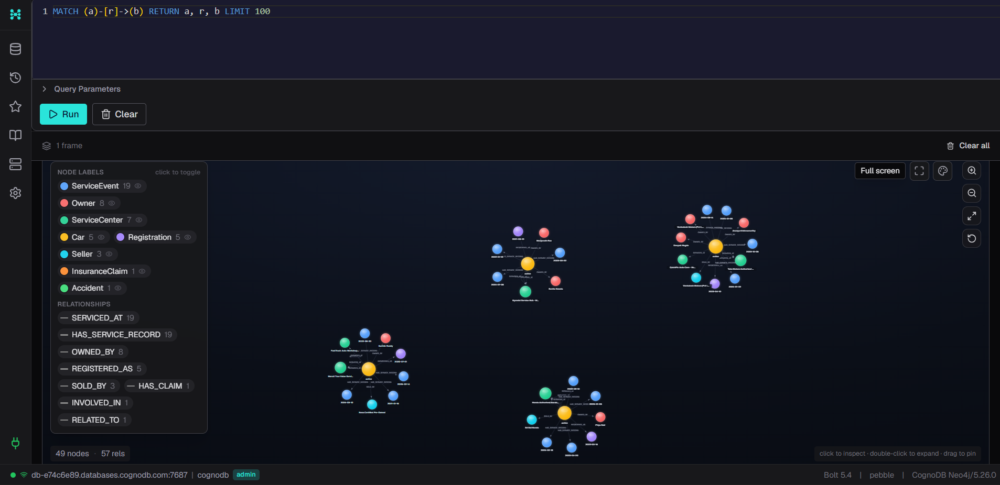
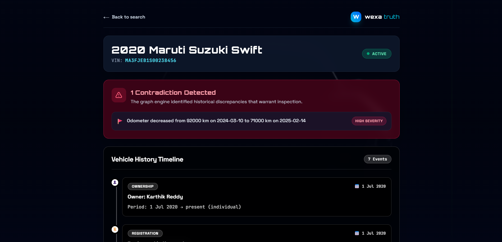
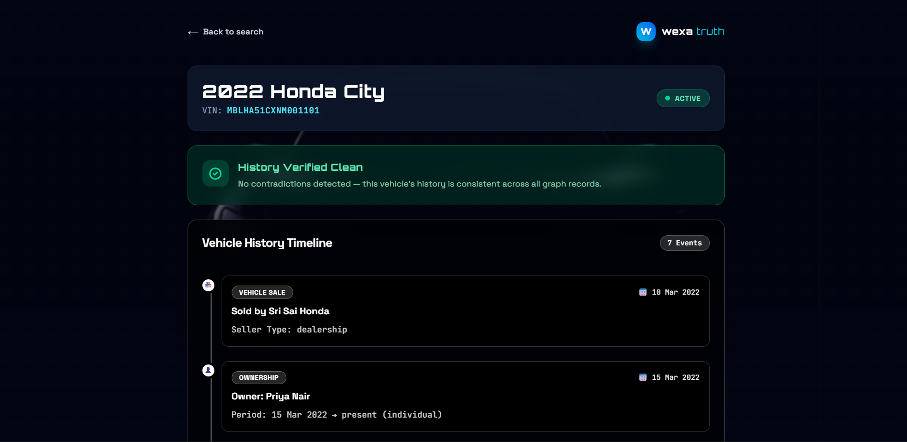
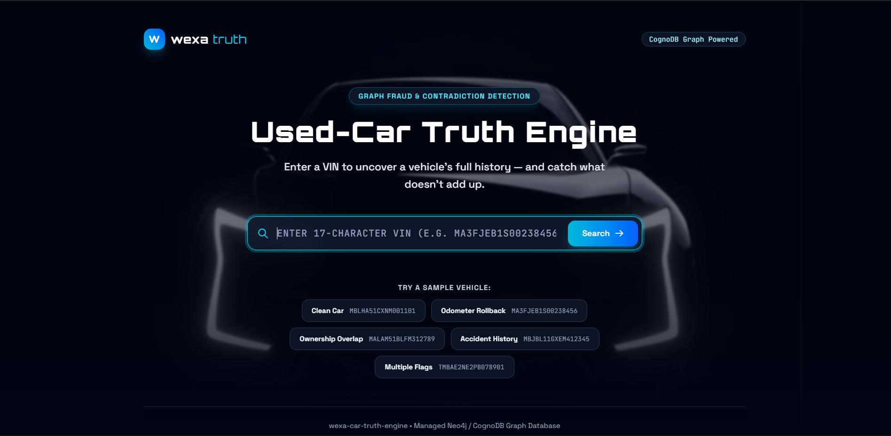

# 🚗 Used-Car Truth Engine

A graph-powered vehicle history and fraud-detection application built for the Wexa AI Software Engineer (Full-Stack/Web) take-home assignment. Enter a VIN and get back a complete, chronological history of a vehicle — plus automatic detection of contradictions in that history, like rolled-back odometers or overlapping ownership records.

**Live Demo:** TODO — add your deployed frontend URL here
**Screen Recording:** TODO — add your recording link here

---

## The Problem

When someone buys a used car, they're trusting a patchwork of disconnected records — service logs, insurance claims, registration papers, seller history — to tell them the truth about a vehicle's past. In practice, no one cross-checks these records against each other. An odometer reading that goes *down* between two service visits, or two owners whose registration periods overlap, are both signs of tampering or fraud — but they're invisible unless someone actually walks the full history and looks for inconsistencies.

The Used-Car Truth Engine does that walk automatically, and shows the buyer exactly what doesn't add up — and why.

## Why a Graph Database?

A vehicle's history isn't naturally tabular — it's a web of connected events and entities: a car has owners, each owner has a time window; the car has service visits, each with its own date and odometer reading; it may have insurance claims linked to accidents; it has registrations and sales. The questions worth asking about this data are inherently about *relationships and sequence*, not isolated rows:

- "Walk this car's entire connected history — every owner, service, claim, accident, and registration — in one traversal." In a relational schema this means five or six separate joins across independent tables, reassembled in application code. In Cypher, it's a single pattern-matched traversal from one `Car` node outward.
- "Find any two points in this car's timeline where the story contradicts itself." This is naturally a sequence-walk over connected, ordered nodes — exactly what a graph traversal is built for. In SQL, replicating this requires window functions, self-joins, and correlated subqueries that get harder to read and maintain as more relationship types are added.

CognoDB (openCypher over Bolt, Neo4j-compatible) lets us express "give me everything connected to this car" as a single readable query, and lets the contradiction-detection logic work directly off naturally-ordered, connected data rather than reconstructing relationships from foreign keys.

---

## Tech Stack

- **Frontend:** React (Vite) + Tailwind CSS + React Router
- **Backend:** Node.js + Express
- **Database:** CognoDB Cloud (managed graph database, openCypher/Bolt, Neo4j-driver compatible)
- **Driver:** Official `neo4j-driver` npm package

---

## Data Model



*(Screenshot above is a real rendering from the CognoDB browser — the full seeded graph: 49 nodes, 57 relationships across 5 vehicles, with the schema legend visible on the left.)*

### Node labels & properties

| Node | Key properties |
|---|---|
| `Car` | `vin` (unique), `make`, `model`, `year`, `current_status` |
| `Owner` | `owner_id` (unique), `name`, `owner_type` |
| `Seller` | `seller_id` (unique), `name`, `seller_type` |
| `ServiceCenter` | `center_id` (unique), `name`, `location` |
| `ServiceEvent` | `event_id` (unique), `date`, `odometer_km`, `description` |
| `InsuranceClaim` | `claim_id` (unique), `date`, `amount`, `claim_type` |
| `Accident` | `accident_id` (unique), `date`, `severity`, `description` |
| `Registration` | `registration_id` (unique), `date`, `state` |

### Relationship types

(Car)-[:OWNED_BY {from_date, to_date}]->(Owner)
(Car)-[:SERVICED_AT {date}]->(ServiceCenter)
(Car)-[:HAS_SERVICE_RECORD]->(ServiceEvent)
(Car)-[:HAS_CLAIM]->(InsuranceClaim)
(Car)-[:INVOLVED_IN]->(Accident)
(InsuranceClaim)-[:RELATED_TO]->(Accident)
(Car)-[:REGISTERED_AS]->(Registration)
(Car)-[:SOLD_BY {date}]->(Seller)


---

## Core Queries

### 1. Full history traversal (multi-hop)

Given a VIN, this single Cypher query pulls the car's entire connected history — every owner, service event, claim, accident, registration, and seller — in one call:

```cypher
MATCH (c:Car {vin: $vin})
OPTIONAL MATCH (c)-[ob:OWNED_BY]->(o:Owner)
OPTIONAL MATCH (c)-[:HAS_SERVICE_RECORD]->(se:ServiceEvent)
OPTIONAL MATCH (c)-[:HAS_CLAIM]->(claim:InsuranceClaim)
OPTIONAL MATCH (c)-[:INVOLVED_IN]->(acc:Accident)
OPTIONAL MATCH (c)-[:REGISTERED_AS]->(reg:Registration)
OPTIONAL MATCH (c)-[:SOLD_BY]->(seller:Seller)
RETURN c, collect(DISTINCT o) AS owners, collect(DISTINCT se) AS service_events,
       collect(DISTINCT claim) AS claims, collect(DISTINCT acc) AS accidents,
       collect(DISTINCT reg) AS registrations, collect(DISTINCT seller) AS sellers
```

This is the query that would be genuinely awkward in a relational database — six independent one-to-many relationships reassembled into one coherent object graph, in a single readable pass, with no application-side stitching required.

### 2. Contradiction detection

Rather than embedding business logic in Cypher, the app fetches ordered, connected data (service events by date, ownership records by date) via focused Cypher queries, then applies the anomaly-detection rules in the application layer — keeping the graph queries simple and the business logic easy to read, test, and extend. Two structural checks currently run automatically:

- **Odometer rollback / implausible jump** — walks a car's service events in date order and flags any pair where the odometer decreases, or increases at an implausible rate (>500 km/day, tunable).
- **Ownership overlap** — flags any pair of ownership records whose date ranges overlap, which can indicate falsified paperwork or an unreported sale.

---

**Flagged vehicle — odometer rollback detected:**


**Clean vehicle — no contradictions:**


**Search page:**


---

## Setup & Run Instructions

### 1. Create a CognoDB Cloud instance

1. Sign up at [console.cognodb.com/signup](https://console.cognodb.com/signup) (free tier, no card required)
2. Create a free (`c0`) instance and pick a region
3. Copy the connection URI (`bolt+s://<instance-id>.databases.cognodb.com`) and the generated password (shown once) immediately

### 2. Backend setup

```bash
cd server
npm install
```

Create `server/.env` (see `server/.env.example` for the exact keys) with your CognoDB credentials:

NEO4J_URI=bolt+s://<your-instance-id>.databases.cognodb.cloud
NEO4J_USERNAME=cognodb
NEO4J_PASSWORD=<your-password>
NEO4J_DATABASE=neo4j
PORT=5000


Seed the database with sample data:

```bash
node src/db/seed/index.js
```

Start the server:

```bash
npm start
```

Verify it's running: `http://localhost:5000/health` should return `{"status":"ok","database":"connected"}`.

### 3. Frontend setup

```bash
cd client
npm install
```

Create `client/.env`:

VITE_API_URL=http://localhost:5000


Start the dev server:

```bash
npm run dev
```

Visit `http://localhost:5173` (or whichever port Vite reports).

### 4. Try it out

Use any of the pre-seeded sample VINs shown on the search page, or:

| VIN | Scenario |
|---|---|
| `MBLHA51CXNM001101` | Clean history, no flags |
| `MA3FJEB1S00238456` | Odometer rollback |
| `MALAM51BLFM312789` | Ownership date overlap |
| `MBJBL11GXEM412345` | Major accident on record |
| `TMBAE2NE2PB078901` | Implausible mileage jump / multiple owners |

---

## Project Structure

wexa-car-truth-engine/
├── client/ # React frontend (Vite, Tailwind, React Router)
├── server/ # Express backend
│ └── src/
│ ├── config/ # env loading & validation
│ ├── db/ # Neo4j driver singleton + seed script
│ ├── repositories/ # Cypher queries only — no business logic
│ ├── services/ # business logic (e.g. contradiction detection)
│ ├── controllers/ # thin HTTP layer
│ └── routes/
└── docs/ # data model diagram


## Engineering Notes

- All Cypher queries are parameterized — no string concatenation.
- Credentials are read from environment variables only, never committed (see `.gitignore`).
- The `/health` endpoint verifies live database connectivity independently of the app's uptime.
- Seed data is idempotent (`MERGE`-based) — running the seed script multiple times will not create duplicates.
- The frontend shows a friendly error state (not a crash or blank page) if the backend is unreachable or the database connection fails, and the `/health` endpoint independently verifies live database connectivity.
---

